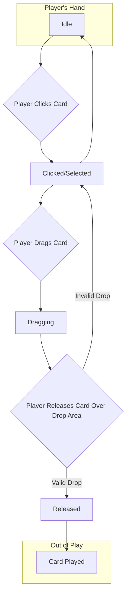

# Card Lifecycle Flow

# Card Lifecycle Flow

This document describes the lifecycle of a single card, from its creation and idle state in the player's hand to being played.

## State Diagram

## Explanation

The card's behavior is managed by a state machine (`card_state_machine.gd`).

Cards have a `base_impact` value (representing damage) and a `preferred_zone` (Work, Commute, Home). Playing a card in its `preferred_zone` grants a Crit (Double Impact) or Refund (Energy back).

1.  **Idle:** The card is in the player's hand, waiting for interaction. It might have a slight hover effect.
2.  **Clicked/Selected:** The player clicks on the card but doesn't drag it. The card is brought into focus, perhaps scaled up slightly, to show it's selected. Clicking again or clicking elsewhere might return it to the `Idle` state.
3.  **Dragging:** The player holds the mouse button down and moves the card. The card's position follows the cursor.
4.  **Released:** The player releases the mouse button.
    *   **Valid Drop:** If the card is released over a valid `CardDropArea` (e.g., the current event), it enters the `Released` state. This triggers the logic to "play" the card.
    *   **Invalid Drop:** If released anywhere else, it returns to the `Clicked/Selected` or `Idle` state, snapping back to its original position in the hand.
5.  **Card Played:** After a valid drop, the card is considered "played." It's removed from the player's hand, and its `base_impact` (potentially modified by `preferred_zone` synergy) and other effects are applied to the `EventEntity`. The card is then moved to a discard pile or removed from the game.

## Relevant Scripts

-   `game_objects/card/card_ui.tscn`: The scene for the visual representation of a card.
-   `game_objects/card/card.gd`: The script attached to the card scene, which delegates behavior to the state machine.
-   `game_objects/card/card_states/card_state_machine.gd`: Manages the card's current state.
-   `game_objects/card/card_states/card_*.gd`: The individual state scripts (e.g., `card_base_state.gd`, `card_dragging_state.gd`).
-   `game_objects/card_drop_area/card_drop_area.gd`: Defines the zones where cards can be played.
