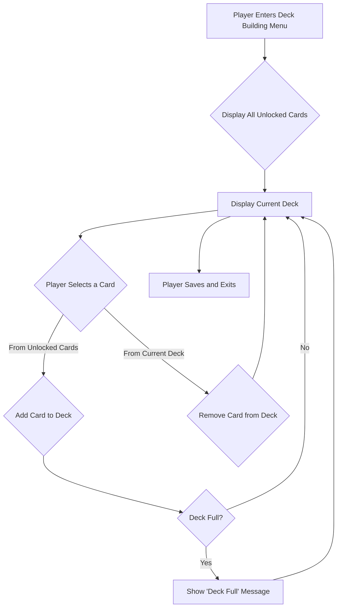

# Deck Management Flow

# Deck Management Flow

This document outlines the deck building process, where the player can create and modify their unified deck of excuse cards.

## Flow Diagram

## Explanation

1.  **Enter Deck Building Menu:** The player navigates to the deck building screen from the main menu or another part of the game.
2.  **Display Card Library:** All cards the player has unlocked are displayed in a scrollable list or grid. This collection is managed by the `CardLibrary`.
3.  **Display Current Deck:** The cards currently in the player's active **unified deck** are displayed in a separate area. This single deck is used for all encounters throughout the game.
4.  **Player Action:**
    *   **Adding a Card:** The player can click or drag a card from their collection to add it to their deck. The system checks for deck size limits and duplicate card rules. Cards also have a `preferred_zone` (Work, Commute, Home), which can influence deck building strategy as playing a card in its preferred zone grants a bonus.
    *   **Removing a Card:** The player can click or drag a card from their current deck back to the library area to remove it.
5.  **Deck Validation:** The system provides feedback, indicating if the deck is full or if any other rules are violated.
6.  **Save and Exit:** Once the player is satisfied with their deck, they save it. This deck is then loaded by the `Deck` object for use in the main game loop.

## Relevant Scenes & Scripts

-   `Main Scenes/Deck Building Menu/`: The main scene for the deck building interface will be located here.
-   `game_objects/deck_builder/deck_builder.tscn`: The UI scene for the deck builder interface.
-   `game_objects/deck/deck.gd`: Represents the player's current deck in the game.
-   `game_objects/card_library/card_library.gd`: Manages the master list of all available and unlocked cards.
-   `game_objects/deck_builder/empty_deck_slot.tscn`: A UI component representing a single slot in the deck list.
