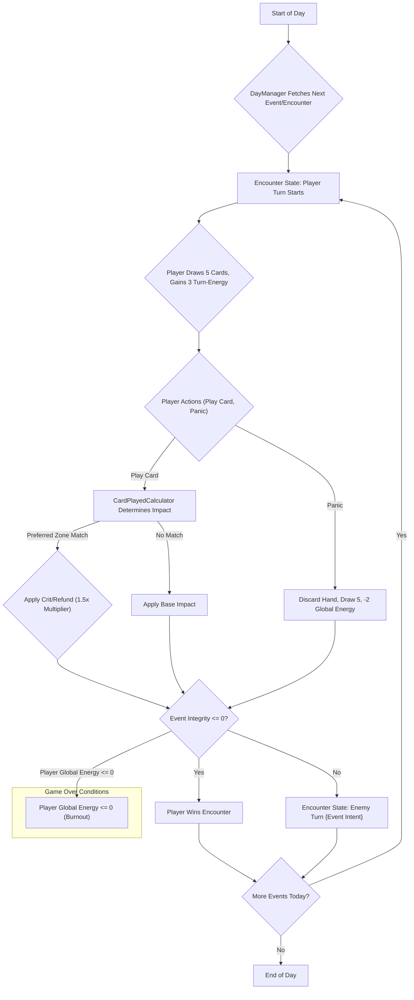

# Event Cycle Flow

# Event Cycle Flow

This document outlines the process of how events (encounters) are managed and presented to the player throughout the game, incorporating multi-turn battles and the 'Panic' mechanic.

## Flow Diagram

## Explanation

Encounters are now multi-turn battles where the player manages their hand, turn-energy, and global energy against an `EventEntity`.

1.  **Start of Day:** The `DayManager` initiates the day's events, transitioning to the `DayLoopState` which then moves to the `BattleState` for each encounter.
2.  **Fetch Next Event/Encounter:** The `LevelLoader` is used to load the next `EventScene`, injecting the `RunState` data.
3.  **Encounter State: Player Turn Starts:** The player begins their turn within the `BattleState`. They draw 5 cards and their `Turn-Energy` is refilled to 3. The `EventEntity` will display its `Intent` for the upcoming `Enemy Turn`.
4.  **Player Actions:**
    *   **Play Excuse Card:** The player selects a card. The `CardPlayedCalculator` determines the `Impact` on the `EventEntity`'s `Integrity`. If the card's `preferred_zone` matches the `EventEntity`'s `context_type`, a Crit (1.5x impact multiplier) or Energy Refund is applied.
    *   **Panic Mechanic:** At any point during their turn, the player can choose to "Panic." This discards their current hand, draws 5 new cards, but costs -2 `Global Energy` (a permanent health reduction for the day). This represents the stress of spiraling.
5.  **Resolution & Turn End:** After the player's actions, the game transitions to a `ResolutionState` (CommandQueue waits for animations) and then to the `EnemyTurn`.
6.  **Outcomes:**
    *   **Winning an Encounter:** If `EventEntity.integrity` drops to 0, the player wins the encounter. The game transitions to a `VictoryState` and loads the next scene/event via the `LevelLoader`.
    *   **Losing the Game (Burnout):** If `Player.global_energy` (Health) hits 0 at any point, the game immediately transitions to a `BurnoutState` (Game Over).
7.  **Loop or End:** The `DayManager` (via the HFSM) checks if there are more events scheduled. If so, a new Player Turn starts. If not, the day ends.

## Relevant Scripts

-   `game_objects/day_manager/day_manager.gd`: Manages the progression of events within the `DayLoopState`.
-   `game_objects/card_played_calculator/card_played_calculator.gd`: Contains the logic for determining card impact, including `preferred_zone` bonuses.
-   `game_objects/event/event_entity.gd`: The base script for event instances, holding `integrity` (HP) and `context_type`.
-   `game_objects/card/card.gd`: The base script for card resources, defining `base_impact` and `preferred_zone`.
-   `systems/level_loader.gd`: Responsible for loading event scenes and injecting `RunState`.
-   `systems/command_queue/command_queue.gd`: Decouples logic and visual execution, critical during `ResolutionState`.
-   `systems/fsm/state_machine.gd` & `game_controller.gd`: Manage the overall game flow, including `WeekLoopState`, `DayLoopState`, and `BattleState` (which contains `PlayerTurn`, `Resolution`, and `EnemyTurn` states).
