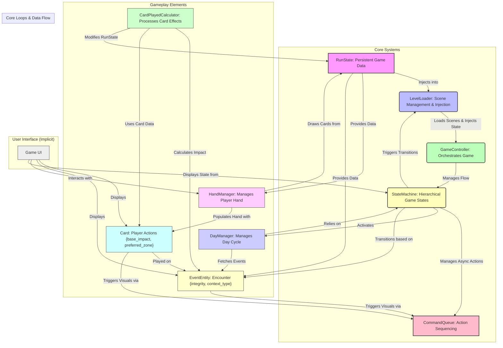

# Game Architecture Overview

This document provides a high-level overview of how the core systems of "Excuse Me" interact to manage game flow, data persistence, and player actions.

## System Interaction Diagram

## Explanation of Interactions

-   **RunState (A):** The central data resource holding the current game's state (deck, energy, relics). It is passed around via **Dependency Injection** by the `LevelLoader`.
-   **LevelLoader (B):** Responsible for loading new scenes (e.g., specific encounters) and injecting the `RunState` into them, ensuring data continuity.
-   **GameController (C):** The top-level orchestrator of the game, holding references to major systems and initiating processes like state changes.
-   **StateMachine (D):** Manages the overall game flow in a hierarchical manner (e.g., `WeekLoopState` -> `DayLoopState` -> `BattleState`). It dictates when different game phases begin and end and triggers scene loads via the `LevelLoader`.
-   **CommandQueue (E):** Decouples game logic from visual feedback. Actions (like a card playing, an event taking damage) are added as `Command` objects, which execute their logic immediately but await their visual completion (animations) before the next command in the queue processes. This prevents visual desynchronization.
-   **Card (F):** Represents an excuse card, defining its `base_impact`, `preferred_zone`, and `effects`. It is a fundamental player interaction element.
-   **EventEntity (G):** The abstraction for "enemies" or challenges. It has `integrity` (HP) and a `context_type` (Work, Commute, Home). Cards are played against EventEntities.
-   **CardPlayedCalculator (H):** Contains the logic for processing a played card's effects. It calculates the impact on the `EventEntity`'s `integrity`, applying bonuses (Crit/Refund) if the card's `preferred_zone` matches the `EventEntity`'s `context_type`.
-   **HandManager (I):** Manages the player's current hand of cards, drawing them from the `RunState`'s deck and instantiating their `CardUI` representations.
-   **DayManager (J):** A state within the `DayLoopState` that progresses through a series of events/encounters for a given day.

This architecture ensures a clear separation of concerns, deterministic turn resolution, and robust data persistence throughout the game.